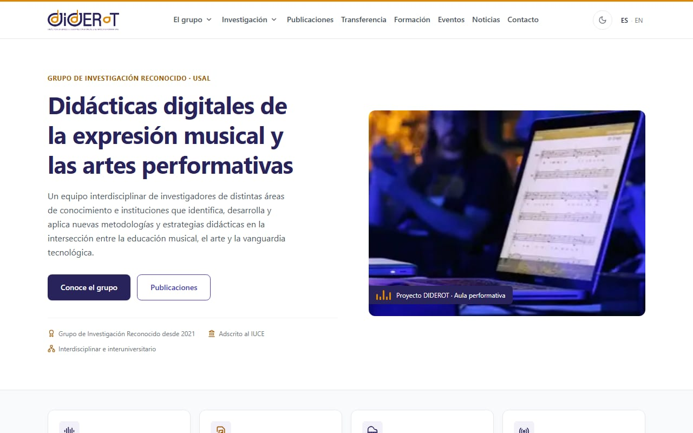
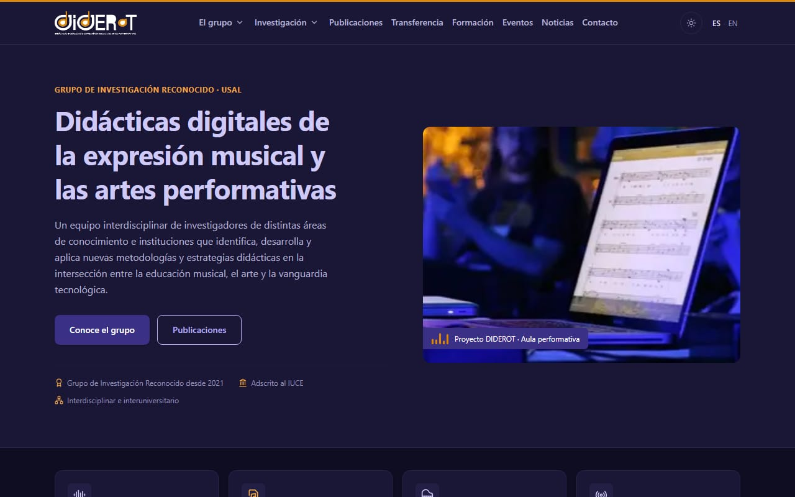
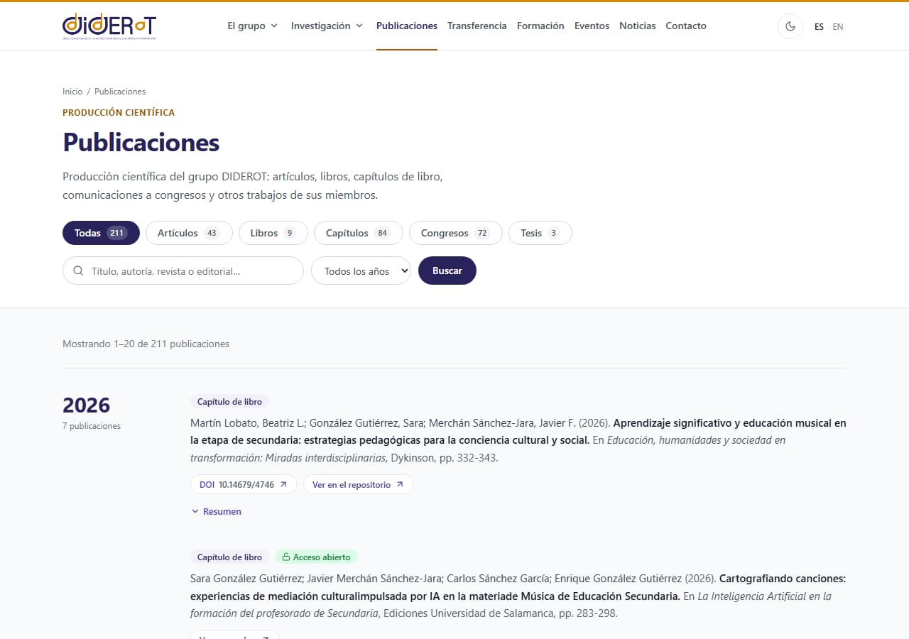
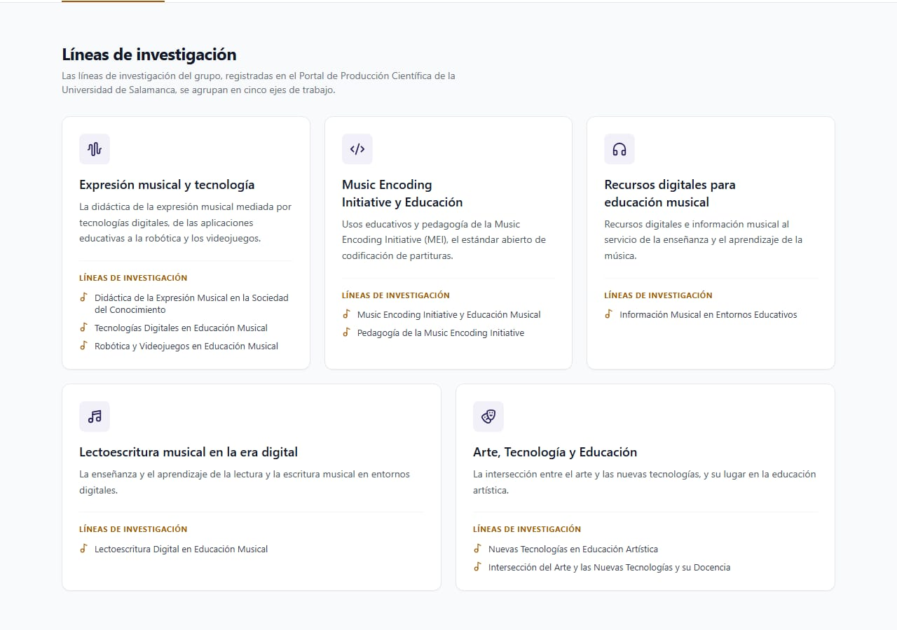
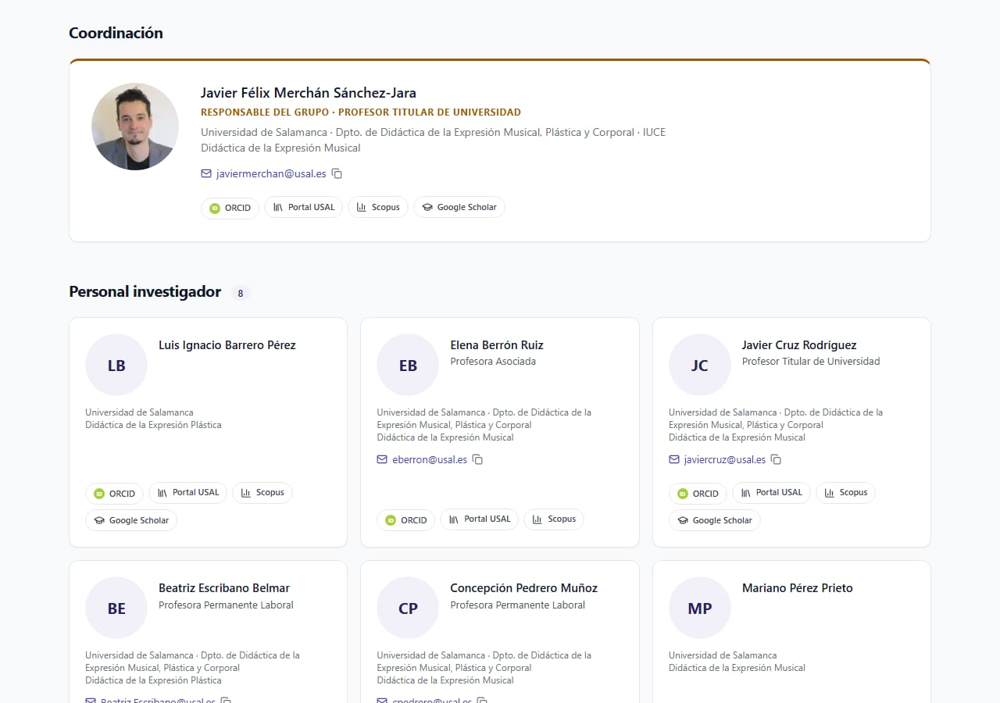
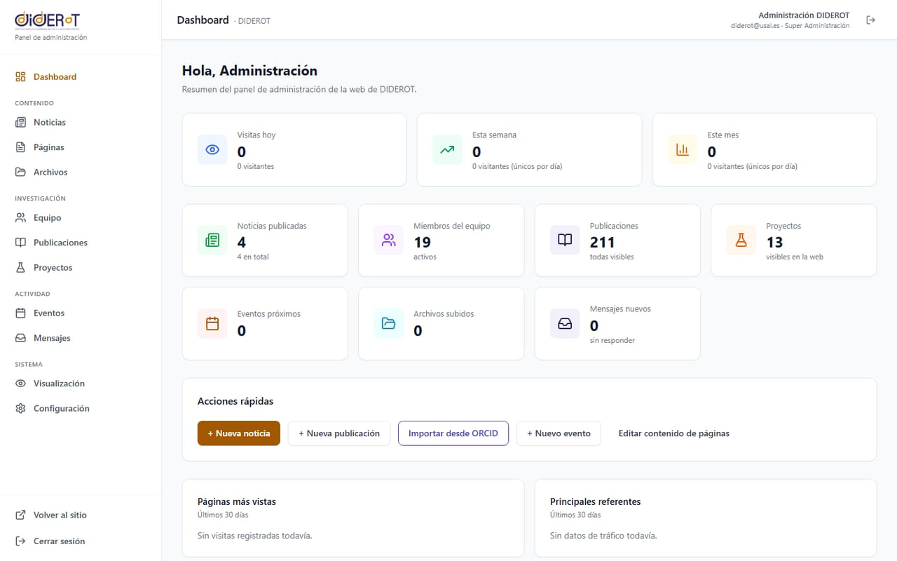
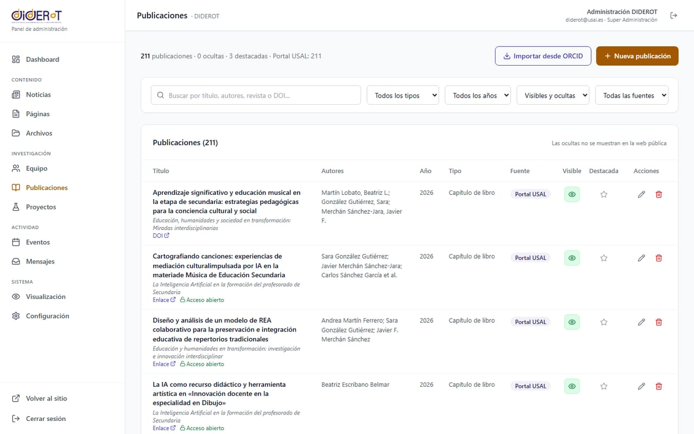
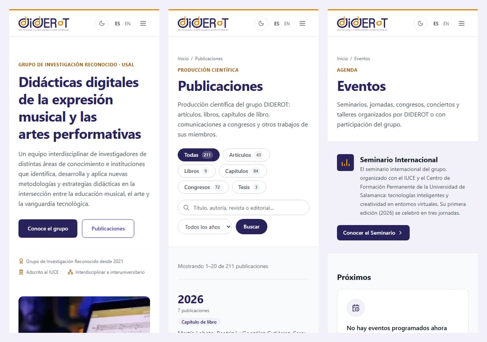

<!-- BANNER -->
<p align="center">
  
</p>

<!-- TYPING TITLE -->
<p align="center">
  <a href="https://github.com/ShockyDEV/DIDEROT-WEB">
    
  </a>
</p>

<!-- BADGES -->
<p align="center">
  
  
  
  
  
  
</p>
<p align="center">
  
  
  
  
</p>

<!-- SKILLICONS -->
<p align="center">
  <a href="https://skillicons.dev">
    
  </a>
</p>

---

## Tabla de contenidos

- [Sobre el proyecto](#sobre-el-proyecto)
- [Capturas](#capturas)
- [Funcionalidades](#funcionalidades)
- [Stack tecnológico](#stack-tecnológico)
- [Puesta en marcha](#puesta-en-marcha)
- [Scripts disponibles](#scripts-disponibles)
- [Estructura del proyecto](#estructura-del-proyecto)
- [Despliegue en producción](#despliegue-en-producción)
- [Seguridad](#seguridad)
- [Contenido y fuentes de datos](#contenido-y-fuentes-de-datos)
- [Identidad visual](#identidad-visual)
- [Calidad y testing](#calidad-y-testing)
- [Estado y hoja de ruta](#estado-y-hoja-de-ruta)
- [Autoría](#autoría)

---

## Sobre el proyecto

**DIDEROT — Didácticas Digitales de la Expresión Musical y las Artes Performativas** es un Grupo de Investigación Reconocido de la **Universidad de Salamanca**, adscrito al [Instituto Universitario de Ciencias de la Educación (IUCE)](https://iuce.usal.es). Reúne a investigadoras e investigadores de distintas áreas e instituciones que trabajan en nuevas metodologías y estrategias didácticas en la intersección entre la educación musical, el arte y la vanguardia tecnológica.

La web anterior del grupo era un WordPress sin mantenimiento que acabó **comprometido**. Este repositorio es su sustituta: una web construida desde cero, con el **mismo stack, arquitectura y lenguaje visual que la nueva web del IUCE**, adaptados a la identidad de DIDEROT, y con un **panel de administración** para que el propio grupo gestione todo el contenido sin programar: noticias, equipo, proyectos, eventos, textos de las páginas y, sobre todo, su **producción científica**, que puede importarse directamente desde ORCID.

> Dominio: [diderot.usal.es](https://diderot.usal.es) (despliegue en preparación)

---

## Capturas

<p align="center">
  
</p>

<table>
  <tr>
    <td width="50%"></td>
    <td width="50%"></td>
  </tr>
  <tr>
    <td align="center"><sub>Modo oscuro</sub></td>
    <td align="center"><sub>Publicaciones: filtros por tipo, año y búsqueda</sub></td>
  </tr>
  <tr>
    <td width="50%"></td>
    <td width="50%"></td>
  </tr>
  <tr>
    <td align="center"><sub>Líneas de investigación (datos oficiales del Portal USAL)</sub></td>
    <td align="center"><sub>Equipo con enlaces a ORCID, Portal, Scopus y Scholar</sub></td>
  </tr>
  <tr>
    <td width="50%"></td>
    <td width="50%"></td>
  </tr>
  <tr>
    <td align="center"><sub>Panel: dashboard con analítica sin cookies</sub></td>
    <td align="center"><sub>Panel de publicaciones e importación ORCID</sub></td>
  </tr>
</table>

<p align="center">
  
</p>

---

## Funcionalidades

**Web pública** (`/` y versión en inglés bajo `/en`)

- **Inicio**: héroe con la foto real del proyecto, accesos rápidos, «DIDEROT en cifras» con datos vivos de la base de datos, actualidad, publicaciones destacadas, cita del grupo y afiliaciones.
- **El grupo**: presentación, objetivos, **equipo** por categorías (coordinación, personal investigador, predoctoral y colaboradores) con buscador y perfiles académicos, y afiliación (IUCE, USAL, doctorado, DIDEROT TransferLab).
- **Investigación**: cinco ejes con las nueve líneas oficiales del grupo y **explorador de proyectos** (ámbito, vigentes/finalizados, búsqueda y orden).
- **Publicaciones**: la producción científica agrupada por año, con filtros por tipo y año, buscador sin tildes, paginación, DOI, acceso abierto y resumen desplegable.
- **Transferencia**, **Formación** (doctorado, tesis dirigidas, Seminario Internacional), **Eventos** (con carteles), **Noticias** (con detalle y RSS), **Contacto** (formulario con Resend y mapa bajo demanda) y páginas legales.
- Modo claro/oscuro, animaciones de aparición y contadores, firma visual propia (ondas sonoras y pentagrama) y SEO: metadatos, Open Graph, JSON-LD, `sitemap.xml`, `robots.txt` y `feed.xml`.

**Panel de administración** (`/backstage`)

- **Publicaciones**: tabla con búsqueda y filtros, alta y edición, visibilidad y destacadas en un clic, e **importación desde ORCID** con vista previa y detección de duplicados (mismo DOI, ya importada o título y año coincidentes, también entre coautores).
- **Equipo**, **Proyectos**, **Eventos** y **Noticias** (editor TipTap) con subida de imágenes; **Archivos**; **Mensajes** del formulario de contacto.
- **Páginas**: todos los textos y listas de la web pública son editables por bloques, con traducción automática al inglés (DeepL, opcional).
- **Dashboard** con recuentos y **analítica propia sin cookies**; **Visualización** para ocultar páginas o secciones; **Configuración** con datos del sitio, cuentas (roles ADMIN / SUPER_ADMIN) y cambio de contraseña.

---

## Stack tecnológico

| Capa | Tecnología | Versión |
|------|------------|---------|
| Framework | [Next.js](https://nextjs.org) (App Router, salida `standalone`) | 14 |
| Lenguaje | TypeScript (modo estricto) | 5 |
| ORM | [Prisma](https://www.prisma.io) | 6 |
| Base de datos | PostgreSQL | 16 |
| Autenticación | [NextAuth.js](https://authjs.dev) v5 (Credentials + bcrypt, JWT) | beta |
| Email transaccional | [Resend](https://resend.com) | 4 |
| Traducción automática | [DeepL API](https://www.deepl.com/pro-api) (opcional) | — |
| Editor de contenido | [TipTap](https://tiptap.dev) | 3 |
| Estilos | [Tailwind CSS](https://tailwindcss.com) + lucide-react | 3 |
| Tests | [Vitest](https://vitest.dev) + Testing Library | 2 |
| Contenerización | Docker + docker compose | — |
| Servidor web | Apache 2 o nginx con HTTPS (Let's Encrypt) | — |

---

## Puesta en marcha

> Requisitos: Node.js 20+, Docker y Docker Compose.

```bash
# 1. Instalar dependencias (genera también el cliente de Prisma)
npm install

# 2. Variables de entorno (los valores de desarrollo funcionan tal cual)
cp .env.example .env

# 3. Levantar PostgreSQL en Docker (127.0.0.1:5436)
docker compose up -d

# 4. Crear el esquema y cargar el contenido real
npm run db:push
npm run db:seed

# 5. Arrancar el servidor de desarrollo
npm run dev
```

La web estará en [http://localhost:3000](http://localhost:3000) y el panel en [http://localhost:3000/backstage](http://localhost:3000/backstage) (en desarrollo: `diderot@usal.es` / `diderot-admin-dev`; la semilla se niega a usar esa contraseña en producción).

<details>
<summary>Variables de entorno</summary>

| Variable | Descripción |
|----------|-------------|
| `DATABASE_URL` | Cadena de conexión a PostgreSQL. |
| `SITE_URL` | URL pública canónica (sitemap, correos, metadatos). |
| `NEXTAUTH_URL` | URL pública del despliegue. |
| `NEXTAUTH_SECRET` | Secreto de las sesiones (`openssl rand -base64 32`). |
| `ADMIN_EMAIL` / `ADMIN_PASSWORD` | Cuenta SUPER_ADMIN que crea la semilla. |
| `TECH_ADMIN_EMAIL` / `TECH_ADMIN_PASSWORD` | Cuenta técnica SUPER_ADMIN (opcional). |
| `RESEND_API_KEY` / `EMAIL_FROM` / `CONTACT_TO` | Envío del formulario de contacto (sin clave, los mensajes se guardan en el panel). |
| `DEEPL_API_KEY` | Traducción automática al inglés al guardar (opcional). |
| `UPLOADS_DIR` | Carpeta de los archivos subidos (por defecto `./uploads`, fuera de `public/`). |

En producción se usan las de `.env.production.example` (ver [despliegue](#despliegue-en-producción)).

</details>

<details>
<summary>Comandos avanzados</summary>

```bash
# Inspeccionar la base de datos en una UI web
npx prisma studio

# Copia de seguridad de la BD de desarrollo (backups/, fuera de git)
npm run db:backup

# Compilar y arrancar la versión de producción en local
npm run build && npm run start
```

</details>

---

## Scripts disponibles

| Comando | Descripción |
|---------|-------------|
| `npm run dev` | Arranca Next.js en modo desarrollo. |
| `npm run build` | Genera el build de producción. |
| `npm run start` | Arranca el build de producción. |
| `npm run lint` | Ejecuta ESLint. |
| `npm run test` | Ejecuta la suite de tests con Vitest. |
| `npm run db:push` | Aplica el esquema Prisma a la base de datos. |
| `npm run db:seed` | Carga el contenido inicial (idempotente y de solo relleno). |
| `npm run db:generate` | Regenera el cliente de Prisma. |
| `npm run db:backup` | Volcado de la base de datos a `backups/`. |

---

## Estructura del proyecto

```
.
├── prisma/
│   ├── schema.prisma          # Modelo de datos (Member, Project, Publication, News, Event…)
│   ├── seed.ts                # Semilla idempotente (nunca pisa lo editado en el panel)
│   └── data/                  # Contenido real: equipo, proyectos, publicaciones, eventos, noticias
├── public/images/             # Logos, equipo, carteles, portadas de noticias
├── src/
│   ├── app/
│   │   ├── (public)/          # Web pública: grupo, investigación, publicaciones, eventos…
│   │   ├── (admin)/backstage/ # Panel de administración
│   │   ├── api/
│   │   │   ├── admin/         # API del panel (publicaciones, ORCID, equipo, archivos…)
│   │   │   ├── contact/       # Formulario de contacto
│   │   │   ├── track/         # Analítica propia sin cookies
│   │   │   └── health/        # Health check (Docker)
│   │   ├── uploads/[...path]/ # Sirve los archivos subidos desde el panel
│   │   └── feed.xml/          # RSS
│   ├── components/            # layout, ui, admin, grupo, publicaciones, eventos…
│   ├── lib/
│   │   ├── content/blocks/    # Textos y listas editables, un módulo por página (ES/EN)
│   │   ├── orcid-import.ts    # Mapeo y deduplicación de la importación ORCID
│   │   ├── uploads.ts         # Subidas seguras: lista cerrada, firma binaria, sin EXIF
│   │   ├── admin-guard.ts     # Protección de la API del panel
│   │   └── site.ts            # Datos fijos del sitio
│   └── middleware.ts          # Idioma (/en) y protección del panel
├── deploy/                    # Guía de despliegue, Apache/nginx, copias, prompt para la VM
├── docs/img/                  # Capturas del README
├── Dockerfile                 # Imagen de producción multietapa
├── docker-compose.yml         # PostgreSQL de desarrollo
└── docker-compose.prod.yml    # Producción: app + BD
```

---

## Despliegue en producción

La web se despliega con **Docker** detrás de **Apache o nginx con HTTPS**:

```
Internet ──HTTPS──▶ Apache/nginx ──▶ 127.0.0.1:3000  diderot-web-app  (Next.js)
                                                          │ red interna sin salida
                                                          ▼
                                                     diderot-web-db   (PostgreSQL 16)
```

```bash
cp .env.production.example .env && chmod 600 .env    # y rellenar secretos
docker compose -f docker-compose.prod.yml build
docker compose -f docker-compose.prod.yml up -d db
docker compose -f docker-compose.prod.yml --profile tools run --rm migrate   # esquema + semilla
docker compose -f docker-compose.prod.yml up -d app
```

La guía completa (proxy inverso, certificados, copias de seguridad diarias, actualizaciones y lista de comprobación de seguridad) está en [`deploy/DESPLIEGUE.md`](deploy/DESPLIEGUE.md), con configuraciones listas para [Apache](deploy/apache/diderot.usal.es.conf) y [nginx](deploy/nginx/diderot.usal.es.conf), el script de [copias de seguridad](deploy/backup-prod.sh) y un [prompt para desplegar con Claude Code](deploy/PROMPT-despliegue.md) en la VM.

---

## Seguridad

Pensada desde el principio para no repetir lo que le ocurrió a la web anterior:

- **Acceso al panel** solo con cuentas creadas por un SUPER_ADMIN (sin registro), contraseñas bcrypt (coste 12), límite de intentos y mensajes de error que no revelan si una cuenta existe.
- **Sesiones revocables**: cada petición del panel revalida la cuenta en la BD; al cambiar o restablecer una contraseña se cierran todas las sesiones abiertas de esa cuenta.
- **API**: validación zod de todo lo que entra, comprobación de origen en las peticiones que cambian datos (CSRF), límites de tamaño y sin detalles internos en los errores.
- **Contenido**: el HTML editable se sanea con lista blanca al guardar, y los enlaces solo pueden ser http(s).
- **Subidas**: se admiten solo tipos de una lista cerrada, comprobando extensión, MIME y firma binaria (sin SVG ni HTML). Las imágenes se recodifican, lo que elimina metadatos EXIF/GPS, y los archivos se sirven con `nosniff` y CSP `sandbox`.
- **Cabeceras**: CSP, HSTS en el proxy, `X-Frame-Options`, `Referrer-Policy`, `Permissions-Policy`; las rutas del antiguo WordPress responden 410 en el proxy.
- **Infraestructura**: contenedor con usuario sin privilegios, sistema de ficheros de solo lectura y sin capacidades; la BD no publica puertos y vive en una red interna.
- **Privacidad**: analítica propia sin cookies (sin guardar IP; respeta «No rastrear») y mapa de Google cargado solo bajo demanda.

---

## Contenido y fuentes de datos

| Contenido | Fuente |
|-----------|--------|
| Presentación, citas y ejes de investigación | Portada de la web antigua recuperada del [Internet Archive](https://web.archive.org/web/20240418173759/https://diderot.usal.es/) (abril de 2024) |
| Equipo (19 personas), 9 líneas oficiales, 11 financiaciones y 3 tesis dirigidas | [Portal de Producción Científica de la USAL](https://produccioncientifica.usal.es/grupos/12132/detalle), grupo 12132 |
| 211 publicaciones del grupo | Portal de Producción Científica de la USAL (importables también desde ORCID en el panel) |
| 2 proyectos adicionales | Memoria del IUCE 2024-2025 |
| Seminario Internacional (3 jornadas) | Carteles oficiales del seminario |

Todo es editable desde el panel. Los textos marcados como provisionales deben revisarse con el grupo.

---

## Identidad visual

Misma maquetación, componentes y animaciones que la web del IUCE, con la paleta del logotipo de DIDEROT y contrastes **WCAG AA verificados** en ambos temas:

| Token | Claro | Oscuro | Uso |
|---|---|---|---|
| `diderot-indigo` | `#29235C` | `#3A3187` | Botones, bandas y fechas (texto blanco) |
| `ink` | `#29235C` | `#CFC9F7` | Titulares |
| `diderot-violet` | `#4A3FB4` | `#B4ACF5` | Enlaces y foco |
| `diderot-amber` | `#A15800` | `#F2A541` | Acentos de texto |
| `diderot-gold` | `#DF8602` | `#DF8602` | Ámbar del logo (decorativo) |

---

## Calidad y testing

- **141 tests** con Vitest en 11 suites: esquemas de validación del panel, mapeo y deduplicación de ORCID (con fixtures de la API real), saneado de HTML, comprobación de origen, analítica, servicios de eventos y noticias, subidas seguras (firmas, EXIF, *path traversal*) y componentes de interfaz.
- **TypeScript estricto** sin errores y **ESLint** limpio.
- Verificación manual de todas las rutas en español e inglés, capturas de escritorio, modo oscuro y móvil sin desbordes, y **prueba de la imagen Docker de producción** construida desde un clon limpio (subida y servicio de archivos, optimización de imágenes, sistema de ficheros de solo lectura).

```bash
npm run test        # suite completa
npx tsc --noEmit    # tipos
npm run lint        # estilo
```

---

## Estado y hoja de ruta

- [x] Base del proyecto a partir de la web del IUCE: stack, tokens de diseño DIDEROT, logos y favicon
- [x] Web pública completa en español e inglés, con modo claro/oscuro
- [x] Contenido real del grupo (Portal USAL, Internet Archive, carteles)
- [x] Panel de administración completo, con **panel de publicaciones e importación ORCID**
- [x] Seguridad reforzada y analítica sin cookies
- [x] Imagen Docker de producción, guía de despliegue y copias de seguridad
- [ ] Migración del histórico de la web antigua (noticias y páginas interiores), con saneado del HTML
- [ ] Revisión de los textos provisionales con el grupo
- [ ] Despliegue en la VM de `diderot.usal.es` (HTTPS)

---

## Autoría

**Grupo DIDEROT** · coordinación: Javier Félix Merchán Sánchez-Jara<br>
Universidad de Salamanca · Instituto Universitario de Ciencias de la Educación (IUCE)

Desarrollo: **Enrique González Gutiérrez**

<p align="center">
  
</p>
